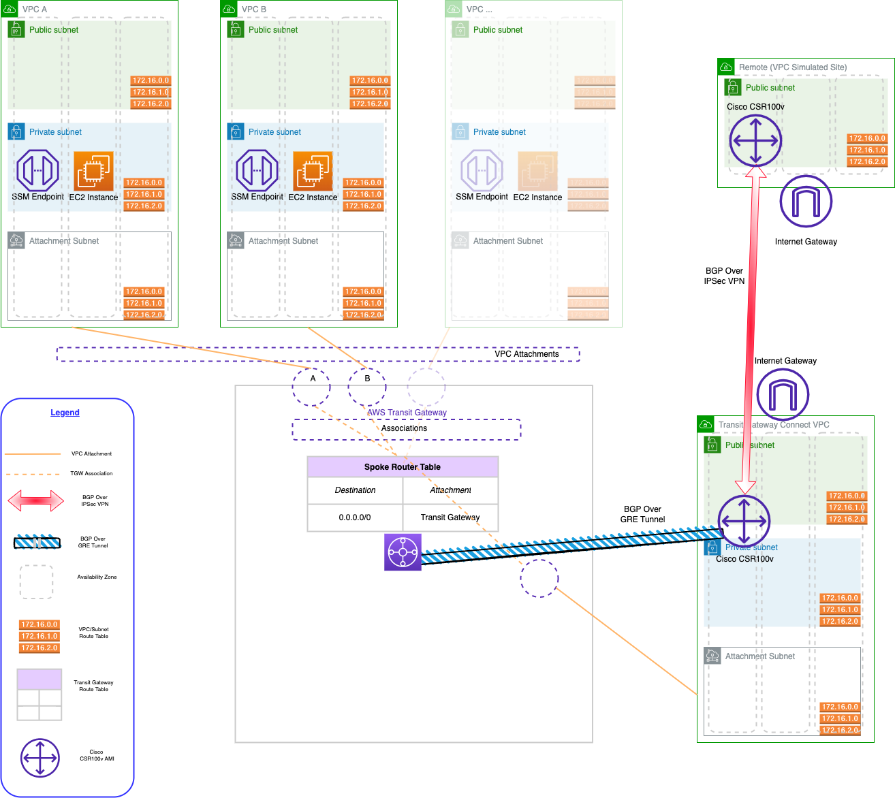

<<<<<<< HEAD
## My Project

TODO: Fill this README out!

Be sure to:

* Change the title in this README
* Edit your repository description on GitHub

## Security

See [CONTRIBUTING](CONTRIBUTING.md#security-issue-notifications) for more information.

## License

This library is licensed under the MIT-0 License. See the LICENSE file.

=======
---

---

# AWS Hub and Spoke Architecture with Shared Services and Transit Gateway Connect VPCs - Terraform Sample

This repository contains terraform code to deploy a sample AWS Hub and Spoke architecture with Shared Services and Transit Gateway Connect VPC, with the following centralized services:

- Managing EC2 instances using AWS Sytems Manager - ssm, ssmmessages and ec2messages VPC Endpoints.
- Deploy a Cisco CSR1000v iinto the Transit Gateway Connect VPC
  - Configure the Cisco CSR1000v using a templated user_data boot strap:
    - Connect to the Transit Gateway Connect Peer using a GRE Tunnel
    - Peer with the Transit Gateway Connect Peer BGP address using BGP
- Deploy a Cisco CSR1000v into a Remote Spoke VPC
  - Configure IPsec from the Remote Spoke VPC to the CSR1000v in the Connect VPC
  - BGP neighbourship between the Remote Spoke CSR1000v with the CSR1000v in the Connect VPC over the IPSec tunnel

The resources deployed and the architectural pattern they follow is purely for demonstration/testing purposes.

## Prerequisites

- An AWS account with an IAM user with the appropriate permissions
- Have a local RSA key (~/.ssh/id_rsa and ~/.ssh/id_rsa.pub). If none exists, use 'ssh-keygen' to generate
- Have an AWS Marketplace subscription for Cisco Cloud Services Router (CSR) 1000v - Transit Network VPC - BYOL software
- Terraform installed

## Code Principles:

- Writing DRY (Do No Repeat Yourself) code using a modular design pattern

## Usage

- Clone the repository
- Edit the *variables.tf* file in the project root directory. This file contains the variables that are used to configure the VPCs to create, and Hybrid DNS configuration needed to work with your environment.
- To change the configuration about the Security Groups and VPC endpoints to create, edit the *locals.tf* file in the project root directory
- Initialize Terraform using `terraform init`
- Deploy the template using `terraform apply`

## Terraform Output:

After the 'terraform apply' has completed, the output will provide all the information required to connect to the CSR 1000v as well as the AWS CLI command to query the relevant AWS Transit Gateway Route Table for propogated routes once BGP neighbours have formed between the AWS Transit Gateway and the Cisco CSR1000v.

------

## Target Architecture

------

### References

- AWS SD-WAN Connectivity Reference Architecture - [SD-WAN Connectivity with AWS Transit Gateway Connect](https://d1.awsstatic.com/architecture-diagrams/ArchitectureDiagrams/sd-wan-deployment-models-ra.pdf?did=wp_card&trk=wp_card)
- AWS Whitepaper - [Building a Scalable and Secure Multi-VPC AWS Network Infrastructure](https://docs.aws.amazon.com/whitepapers/latest/building-scalable-secure-multi-vpc-network-infrastructure/welcome.html)

### Cleanup

Remember to clean up after your work is complete. You can do that by doing `terraform destroy`.

Note that this command will delete all the resources previously created by Terraform.

------

<!-- BEGIN_TF_DOCS -->
## Requirements

| Name | Version |
|------|---------|
|  [terraform](#requirement\_terraform) | >= 1.1.0 |
|  [aws](#requirement\_aws) | ~> 4.4 |

## Providers

| Name | Version |
|------|---------|
|  [aws](#provider\_aws) | 4.4.0 |
|  [external](#provider\_external) | 2.2.0 |
|  [random](#provider\_random) | 3.1.0 |

## Modules

| Name | Source | Version |
|------|--------|---------|
|  [compute](#module\_compute) | ./modules/compute | n/a |
|  [connect\_vpc](#module\_connect\_vpc) | ./modules/connect_vpc | n/a |
|  [iam\_kms](#module\_iam\_kms) | ./modules/iam_kms | n/a |
|  [key\_pairs](#module\_key\_pairs) | ./modules/key_pairs | n/a |
|  [remote\_vpc](#module\_remote\_vpc) | ./modules/remote_vpc | n/a |
|  [transit\_gateway](#module\_transit\_gateway) | ./modules/transit_gateway | n/a |
|  [vpc](#module\_vpc) | ./modules/vpc | n/a |
|  [vpc\_endpoints](#module\_vpc\_endpoints) | ./modules/vpc_endpoints | n/a |

## Resources

| Name | Type |
|------|------|
| [aws_eip.csr_public_ip](https://registry.terraform.io/providers/hashicorp/aws/latest/docs/resources/eip) | resource |
| [random_password.isakmp_secret](https://registry.terraform.io/providers/hashicorp/random/latest/docs/resources/password) | resource |
| [external_external.curlip](https://registry.terraform.io/providers/hashicorp/external/latest/docs/data-sources/external) | data source |

## Inputs

| Name | Description | Type | Default | Required |
|------|-------------|------|---------|:--------:|
|  [amazon\_side\_asn](#input\_amazon\_side\_asn) | BGP ASN for the TGW. | `number` | `64512` | no |
|  [aws\_region](#input\_aws\_region) | AWS Region to create the environment. | `string` | `"eu-west-1"` | no |
|  [connect\_peer\_cidr\_blocks](#input\_connect\_peer\_cidr\_blocks) | cidr blocks for connect peer | `list(string)` | <pre>[   "169.254.200.0/29" ]</pre> | no |
|  [eips](#input\_eips) | n/a | `map(any)` | <pre>{   "connect_csr_eip": {     "tags": {       "Name": "connect-csr-eip",       "Type": "ConnectCSR"     }   },   "remote_csr_eip": {     "tags": {       "Name": "remote-csr-eip",       "Type": "RemoteSR"     }   } }</pre> | no |
|  [on\_premises\_cidr](#input\_on\_premises\_cidr) | On-premises CIDR block. | `string` | `"192.168.0.0/16"` | no |
|  [project\_identifier](#input\_project\_identifier) | Project Name, used as identifer when creating resources. | `string` | `"hub-spoke-connect"` | no |
|  [transit\_gateway\_cidr\_block](#input\_transit\_gateway\_cidr\_block) | cidr blocks for connect peer | `string` | `"192.168.100.0/24"` | no |
|  [tunnel\_cidr\_block](#input\_tunnel\_cidr\_block) | cidr blocks for connect peer | `string` | `"169.254.201.0/29"` | no |
|  [vpcs](#input\_vpcs) | VPCs to create. | `map(any)` | <pre>{   "connect-vpc-1": {     "cidr_block": "10.132.0.0/16",     "csr_hostname_prefix": "csr",     "csr_instance_size": "c5.large",     "instance_count": 1,     "local_bgp_asn": 64515,     "number_azs": 2,     "remote_bgp_asn": 64512,     "spoke_type": "connect"   },   "remote-vpc-1": {     "cidr_block": "10.251.0.0/16",     "csr_hostname_prefix": "csr",     "csr_instance_size": "c5.large",     "instance_count": 1,     "local_bgp_asn": 64516,     "number_azs": 2,     "remote_bpg_asn": 64515,     "spoke_type": "remote"   },   "spoke-vpc-1": {     "cidr_block": "10.11.0.0/16",     "instance_type": "t2.micro",     "number_azs": 1,     "spoke_type": "spoke"   },   "spoke-vpc-2": {     "cidr_block": "10.12.0.0/16",     "instance_type": "t2.micro",     "number_azs": 1,     "spoke_type": "spoke"   } }</pre> | no |

## Outputs

| Name | Description |
|------|-------------|
|  [connect\_aws\_eip\_csr\_public\_ip](#output\_connect\_aws\_eip\_csr\_public\_ip) | Public IP of the AWS EIP Connect CSR instance |
|  [connect\_csr\_instance\_id](#output\_connect\_csr\_instance\_id) | Instance ID of the CSR instance created |
|  [instances\_created](#output\_instances\_created) | Instances created in each VPC |
|  [isakmp\_secret](#output\_isakmp\_secret) | ISAKMP secret key |
|  [remote\_aws\_eip\_csr\_public\_ip](#output\_remote\_aws\_eip\_csr\_public\_ip) | Public IP of the AWS EIP remote CSR instance |
|  [tgw\_route\_table\_id](#output\_tgw\_route\_table\_id) | Transit Gateway Route Table ID |
|  [transit\_gateway](#output\_transit\_gateway) | Transit Gateway ID |
|  [vpc\_endpoints](#output\_vpc\_endpoints) | DNS name (regional) of the VPC endpoints created. |
|  [vpcs](#output\_vpcs) | List of VPCs created |
|  [z\_output\_user\_message](#output\_z\_output\_user\_message) | Route table search command |
<!-- END_TF_DOCS -->                                         |                                                   |

------

## Security

See [CONTRIBUTING](CONTRIBUTING.md) for more information.

------

## License

This library is licensed under the MIT-0 License. See the [LICENSE](LICENSE) file.
